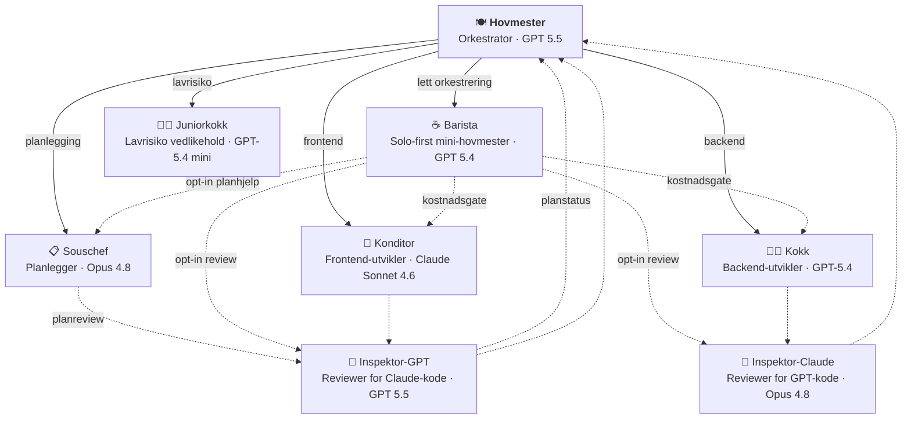

# hovmester 🍽️

Multi-agent Copilot-orkestrering for Nav-team. Én workflow gir repoet ditt en orkestrator (hovmester), en planlegger (souschef), en lavrisiko-vedlikeholder (juniorkokk), spesialister (kokk/konditor) og kryssmodell-reviewere (inspektører) — pluss felles instruksjoner, skills og issue-/PR-templates.

## Kom i gang

Legg til denne workflowen i repoet ditt som `.github/workflows/hovmester-sync.yml`:

```yaml
name: Sync hovmester
on:
  schedule:
    - cron: '0 5 * * *'
  workflow_dispatch:

permissions:
  contents: write
  pull-requests: write

jobs:
  sync:
    uses: navikt/hovmester/.github/workflows/hovmester-sync.yml@main
    with:
      collections: "frontend"              # eller "backend", "backend,frontend", "product"
      github_project: "navikt/157"         # valgfritt: bytt til ditt teams GitHub Project, eller fjern linjen
      # team_repo: "navikt/team-foo"       # for @doctor-who (krever collections: "product"): teamets fellesrepo for mål og tavle-guide
```

Kjør workflowen manuelt første gang via `Actions` → `Sync hovmester` → `Run workflow`. Den oppretter en PR med alle filer klare i `.github/`. Merge → du er i gang.

Dette er nok hvis du vil ha sync-PRer og merge manuelt. Hvis du vil auto-merg'e dem, se [Auto-merge](#auto-merge-valgfritt) lenger ned.

Hvis repoet ditt har required CI-checks på PRer, anbefaler vi også App-oppsettet under. Da opprettes sync-PRer som vanlige PRer og trigger CI normalt.

## Agenter

Bruk **@hovmester** når du vil ha full orkestrering med planlegger og review som standard. Bruk **@barista** når du vil ha solo-first flyt, egen plan og tydelig kostnad før dyrere steg.



| Agent | Rolle | Modell |
|-------|-------|--------|
| **@hovmester** 🍽️ | Orkestrator — mottar forespørselen, delegerer, konsoliderer | GPT 5.5 |
| **@barista** ☕ | Kostnadsbevisst mini-hovmester — planlegger og implementerer solo-first, bruker spesialister når de gir verdi og review som opt-in | GPT 5.4 |
| *@juniorkokk* 🧑‍🍳 | *(intern)* Lavrisiko vedlikeholder — docs, tekst, templates, små config-endringer | GPT-5.4 mini |
| *@kokk* 👨‍🍳 | *(intern)* Backend-utvikler — API, tjenester, database, Kafka, infra | GPT-5.4 |
| *@konditor* 🎂 | *(intern)* Frontend-utvikler — UI, Aksel, tilgjengelighet, state | Claude Sonnet 4.6 |
| *@souschef* 📋 | *(intern)* Planlegger — utforsker kodebasen, lager implementasjonsplaner | Opus 4.8 |
| **@designer** ✏️ | Designer-agent — designhjelp, Figma-skisser og visuelle konsepter | Opus 4.8 |
| **@doctor-who** 🕰️ | Produktleder-agent — teamstatus, prioritering, oppgaver, OKR, workshops/teamhelse og discovery | Opus 4.8 |
| *@inspektor-claude* 🔬 | *(intern)* Kryssmodell-reviewer — Opus 4.8 gjennomgår GPT-kode | Opus 4.8 |
| *@inspektor-gpt* 🔬 | *(intern)* Kryssmodell-reviewer — GPT gjennomgår Claude-kode | GPT 5.5 |

> Én agent eier hele funksjonssnitt vertikalt. I ikke-trivielle arbeidsflyter fanger kryssmodell-review blindsoner: Claude gjennomgår GPT-kode, og GPT gjennomgår både Claude-kode og Souschef-planer for medium/store oppgaver før hovmester presenterer planen.

## Collections

Collections grupperer instruksjoner, skills og agenter i navngitte pakker du velger ved oppsett. `hovmester`-collectionen inkluderes alltid automatisk.

| Collection | Beskrivelse |
|---|---|
| `hovmester` *(alltid inkludert)* | Orkestrator-agentene, felles instruksjoner (sikkerhet, Docker, GitHub Actions), generiske skills og issue-/PR-templates |
| `backend` | Kotlin-instruksjon + 7 backend-skills (Ktor, Spring, Flyway, Kafka, Postgres, API-design, auth) |
| `frontend` | Frontend- og tilgjengelighets-instruksjoner + 7 frontend-skills (accessibility-review, Aksel, auth, dulting, Figma-workflow, Lumi, prototype) + designer-agent |
| `product` | Produktleder-agenten @doctor-who + 4 PM-skills (team-status, OKR, workshop-design, produktledelse). Beregnet på teamets produkt-/fellesrepo — sett gjerne `team_repo` sammen med denne |

**Eksempler:**
- `"backend"` — backend-repo
- `"frontend"` — frontend-repo
- `"backend,frontend"` — fullstack-repo
- `"product"` — produkt-/fellesrepo med @doctor-who (sett `team_repo` til samme repo)
- *(ingen collection utover hovmester)* — bare orkestratoren og generiske skills

## Konfigurasjon

| Input | Beskrivelse | Påkrevd |
|---|---|---|
| `collections` | Kommaseparert liste over collections (`backend`, `frontend`, `product`, eller en kombinasjon). `hovmester` er alltid inkludert. | Ja |
| `exclude` | Kommaseparert liste over ting som skal utelates, f.eks. `"kafka-topic,epic"`. | Nei |
| `github_project` | Valgfritt GitHub Project i format `owner/number`, f.eks. `"navikt/123"`. Fjern linjen hvis teamet ikke bruker GitHub Projects. | Nei |
| `team_repo` | Valgfritt fellesrepo for teamets mål og tavle-guide i format `owner/repo`, f.eks. `"navikt/team-esyfo"`. Brukes av @doctor-who (`product`-collectionen). Fjern linjen hvis teamet ikke har et fellesrepo. | Nei |
| `pr_app_id` | GitHub App ID for PR-opprettelse. Anbefalt når du bruker auto-merge eller har required CI-checks. | Nei |

| Secret | Beskrivelse |
|---|---|
| `APP_PRIVATE_KEY` | GitHub App private key for PR-opprettelse. Brukes sammen med `pr_app_id`. |

### Issue templates

Default-settet er `bug`, `feature`, `story`, `task` og `epic` (pluss `config`). Hvis du vil utelate noen, bruk `exclude: "epic,task"`.

Hvis `github_project` er satt, auto-linkes nye issues til det prosjektet. Hvis ikke, opprettes de uten prosjekttilknytning.

### Auto-merge (valgfritt)

Auto-merge er valgfritt. Hvis du bare vil ha sync-PRer og merge manuelt, kan du stoppe etter **Kom i gang**.

Hvis du vil auto-merg'e sync-PRene, trenger du fire ting:

1. En GitHub App som oppretter PRen
2. En verify-workflow i consumer-repoet
3. En egen automerge-workflow i consumer-repoet
4. Branch protection som krever verify-jobben

| Ønske | Det du trenger |
|---|---|
| Manuell merge | Kun `hovmester-sync.yml` |
| Manuell merge + vanlig CI på sync-PRer | `hovmester-sync.yml` + GitHub App |
| Auto-merge | `hovmester-sync.yml` + GitHub App + `hovmester-verify.yml` + `hovmester-automerge.yml` |

**Steg 1 — Opprett GitHub App**

Opprett en [GitHub App](https://docs.github.com/en/apps/creating-github-apps) og installer den i consumer-repoet.

App-installasjonen trenger minst:

- **Contents: Read & write**
- **Pull requests: Read & write**

Lagre deretter:

- Private key som secret: `HOVMESTER_APP_PRIVATE_KEY`
- App ID — du bruker den direkte i sync-workflowen (`pr_app_id: "123456"`)
- Bot-login — du bruker den i verify- og automerge-workflowene (f.eks. `my-sync-app[bot]`)

Repoet må også ha dette slått på:

- **Allow auto-merge**
- **Allow squash merging**
- **Settings → Actions → General → Workflow permissions → Allow GitHub Actions to create and approve pull requests**

> **Bot-approval:** Hvis dere bruker branch protection eller CODEOWNERS, må oppsettet tillate at sync-PRer kan godkjennes av `github-actions[bot]`. Sørg også for at `.github/`-stier ikke krever manuell CODEOWNERS-review.

**Steg 2 — Send App-credentials inn i sync-workflowen**

Oppdater sync-workflowen fra **Kom i gang** med disse to linjene:

```yaml
jobs:
  sync:
    uses: navikt/hovmester/.github/workflows/hovmester-sync.yml@main
    with:
      collections: "frontend"
      github_project: "navikt/157"         # valgfritt
      pr_app_id: "123456"                  # din GitHub Apps ID
    secrets:
      APP_PRIVATE_KEY: ${{ secrets.HOVMESTER_APP_PRIVATE_KEY }}
```

Da opprettes sync-PRen av Appen i stedet for `github-actions[bot]`. Det gjør to ting:

- vanlige `pull_request`-checks og CI trigges som normalt
- automerge-workflowen kan godkjenne PRen med `GITHUB_TOKEN` uten self-approval-konflikt

Hvis du bare trenger at CI skal trigges på sync-PRer, kan du stoppe her og merge manuelt.

**Steg 3 — Kopier referansemalene**

Bruk repoets referansemaler som startpunkt:

- [`templates/hovmester-automerge/hovmester-verify.yml`](templates/hovmester-automerge/hovmester-verify.yml)
- [`templates/hovmester-automerge/hovmester-automerge.yml`](templates/hovmester-automerge/hovmester-automerge.yml)
- [`templates/hovmester-automerge/README.md`](templates/hovmester-automerge/README.md)

Disse filene er den kanoniske YAML-referansen for verify/automerge-mønsteret. De ligger bevisst utenfor `dist/`, blir ikke distribuert av sync-scriptet, og er ment som manuell rollout-støtte når du skal legge workflowene inn i et consumer-repo.

Når du kopierer malene til consumer-repoet under `.github/workflows/`, må du minst bytte ut disse plassholderne:

- `__EXPECTED_PR_AUTHOR__` — GitHub App-botens login, for eksempel `my-sync-app[bot]`
- `__APP_ID__` — GitHub App-ID-en som brukes for hovmester-sync
- `__APP_PRIVATE_KEY_SECRET__` — secret-navnet som inneholder App private key

`hovmester-verify.yml` er read-only: `contents: read`, `pull-requests: read`, ingen secrets og ingen write-token. Behold job-navnet `verify-hovmester-sync` uendret. Det er check-navnet branch protection og merge queue skal peke på. Workflowen skal alltid rapportere denne checken når den trigges: grønn no-op på vanlige PRer og `merge_group`, og faktisk verifisering bare for same-repo `hovmester-sync`-PRer.

**Steg 4 — Behold sikkerhetsmodellen i automerge-workflowen**

`workflow_run` bruker workflow-fila fra default branch og kjører aldri PR-kode. Likevel må denne workflowen alltid re-verifisere fail closed via GitHub API før approval og auto-merge, fordi verify-workflowen på `pull_request` kan bruke workflow-definisjonen fra PR-branchen.

Token-skillet er bevisst:

- `GITHUB_TOKEN` brukes til re-verifisering via GitHub API og approval, ikke til auto-merge/merge queue, og referansemalen snevrer det inn til `pull-requests: write` i automerge-jobben
- GitHub App-tokenet brukes til auto-merge/merge queue og App-installasjonen trenger minst `contents: write` og `pull-requests: write`
- `actions/create-github-app-token` støtter permission-inputs, så referansemalen snevrer App-tokenet inn til bare disse rettighetene

**Steg 5 — Sett branch protection og merge queue**

- Sett `verify-hovmester-sync` som required status check på default branch. Checken rapporterer grønt/no-op for vanlige PRer og `merge_group`, og verifiserer bare same-repo `hovmester-sync`-PRer.
- Behold repoets øvrige vanlige required checks for vanlige PRer, for eksempel CI-, test- og security-checks. `verify-hovmester-sync` er et tillegg for hovmester-sync, ikke en erstatning for annen branch protection
- Ikke sett automerge-workflowen som required check
- Hvis repoet bruker merge queue, må både `verify-hovmester-sync` og andre required checks støtte `merge_group`
- Første gang: merge `hovmester-verify.yml` og `hovmester-automerge.yml` til default branch før du aktiverer branch protection

Når hovmester lager en sync-PR:

1. PRen opprettes av GitHub Appen
2. `verify-hovmester-sync` kjører på `pull_request` og `merge_group`, rapporterer alltid checken og skipper ikke-hovmester-PRer med `exit 0`
3. Automerge-workflowen trigges via `workflow_run`, re-verifiserer PRen fra default branch og godkjenner den med `GITHUB_TOKEN`
4. GitHub App-tokenet setter PRen i auto-merge eller merge queue med `gh pr merge --auto --squash --match-head-commit`

**Migrering fra gammel `pull_request_target`-workflow**

1. Erstatt den gamle kombinerte workflowen med to filer: `hovmester-verify.yml` og `hovmester-automerge.yml`
2. Behold required check-navnet `verify-hovmester-sync`
3. Fjern gammel `pull_request_target`-workflow når de nye workflowene ligger på default branch
4. Ikke gjør automerge-workflowen required

**Sikkerhetsmodell**

- Sync-scriptet forvalter bare hovmesters managed paths under `.github/`
- `.github/workflows/` er alltid ekskludert fra sync og eksplisitt forbudt i verify- og automerge-workflowene
- Verify-workflowen er read-only og bruker ingen secrets
- Automerge-workflowen kjører på default branch-kode og godtar bare same-repo-PRer fra `hovmester-sync`
- Automerge re-verifiserer konklusjon, `workflow_run.event`, forfatter, same-repo-krav, fil-allowlist og head SHA før approval og merge
- `--match-head-commit` binder merge-steget til verifisert SHA, så en oppdatert branch ikke kan få auto-merge på gammel verifisering

## Slik fungerer det

Workflowen kjøres på cron (eller manuell trigger), sammenligner ditt repos `.github/`-katalog med den valgte collectionen, og oppretter en PR hvis noe har endret seg. Manifest-fila `.github/.hovmester-manifest.json` sporer hvilke filer som er eid av hovmester, så stale filer fjernes automatisk.

Workflowen endrer aldri filer utenfor `.github/`, og `.github/workflows/` er alltid ekskludert — workflows eier du selv. Synkede filer forvaltes av hovmester — ikke rediger dem manuelt, lag egne filer for repo-spesifikke tilpasninger.

## For designere

Er du designer og vil bruke Copilot? Se [Copilot for designere — kom i gang](docs/designer-oppsett.md).

## For produktledere

Er du produktleder og vil bruke Copilot? Se [Copilot for produktledere — kom i gang](docs/produktleder-oppsett.md).

## Bidra

Se `.github/copilot-instructions.md` for arkitektur, filstruktur, og retningslinjer for å legge til nye agenter, instructions og skills.
