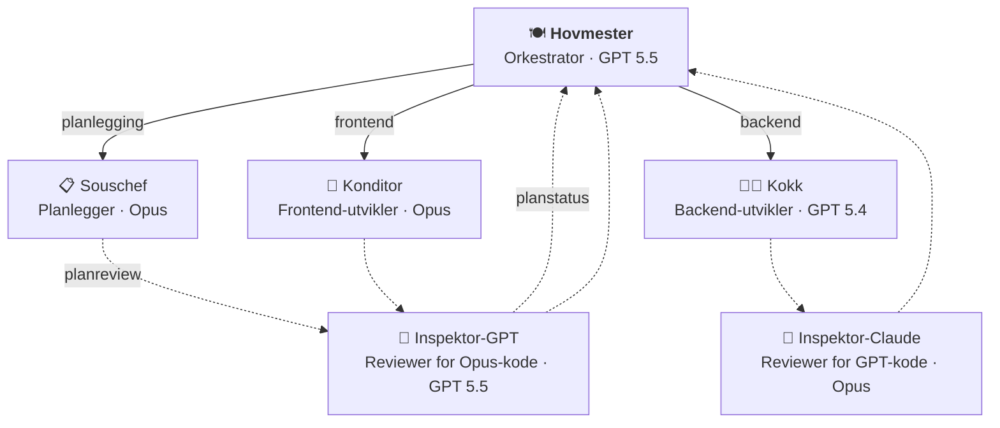

# hovmester 🍽️

Multi-agent Copilot-orkestrering for Nav-team. Én workflow gir repoet ditt en orkestrator (hovmester), en planlegger (souschef), spesialister (kokk/konditor) og kryssmodell-reviewere (inspektører) — pluss felles instruksjoner, skills og issue-/PR-templates.

## Kom i gang

Legg til denne workflowen i repoet ditt som `.github/workflows/hovmester-sync.yml`:

```yaml
name: Sync hovmester
on:
  schedule:
    - cron: '0 5 * * *'
  workflow_dispatch:

permissions:
  contents: write
  pull-requests: write

jobs:
  sync:
    uses: navikt/hovmester/.github/workflows/hovmester-sync.yml@main
    with:
      collections: "frontend"              # eller "backend", "backend,frontend"
      github_project: "navikt/157"         # valgfritt: bytt til ditt teams GitHub Project, eller fjern linjen
```

Kjør workflowen manuelt første gang via `Actions` → `Sync hovmester` → `Run workflow`. Den oppretter en PR med alle filer klare i `.github/`. Merge → du er i gang.

Dette er nok hvis du vil ha sync-PRer og merge manuelt. Hvis du vil auto-merg'e dem, se [Auto-merge](#auto-merge-valgfritt) lenger ned.

Hvis repoet ditt har required CI-checks på PRer, anbefaler vi også App-oppsettet under. Da opprettes sync-PRer som vanlige PRer og trigger CI normalt.

## Agenter

Bruk **@hovmester** som inngang til alt — den koordinerer planlegging, implementasjon og kodegjennomgang automatisk.



| Agent | Rolle | Modell |
|-------|-------|--------|
| **@hovmester** 🍽️ | Orkestrator — mottar forespørselen, delegerer, konsoliderer | GPT 5.5 |
| *@kokk* 👨‍🍳 | *(intern)* Backend-utvikler — API, tjenester, database, Kafka, infra | GPT 5.4 |
| *@konditor* 🎂 | *(intern)* Frontend-utvikler — UI, Aksel, tilgjengelighet, state | Opus |
| *@souschef* 📋 | *(intern)* Planlegger — utforsker kodebasen, lager implementasjonsplaner | Opus |
| **@designer** ✏️ | Designer-agent — designhjelp, Figma-skisser og visuelle konsepter | Opus |
| *@inspektor-claude* 🔬 | *(intern)* Kryssmodell-reviewer — Opus gjennomgår GPT-kode | Opus |
| *@inspektor-gpt* 🔬 | *(intern)* Kryssmodell-reviewer — GPT gjennomgår Opus-kode | GPT 5.5 |

> Én agent eier hele funksjonssnitt vertikalt. I ikke-trivielle arbeidsflyter fanger kryssmodell-review blindsoner: Opus gjennomgår GPT-kode, og GPT gjennomgår både Opus-kode og Souschef-planer for medium/store oppgaver før hovmester presenterer planen.

## Collections

Collections grupperer instruksjoner, skills og agenter i navngitte pakker du velger ved oppsett. `hovmester`-collectionen inkluderes alltid automatisk.

| Collection | Beskrivelse |
|---|---|
| `hovmester` *(alltid inkludert)* | Orkestrator-agentene, felles instruksjoner (sikkerhet, Docker, GitHub Actions), 13 generiske skills og issue-/PR-templates |
| `backend` | Kotlin-instruksjon + 7 backend-skills (Ktor, Spring, Flyway, Kafka, Postgres, API-design, auth) |
| `frontend` | Frontend- og tilgjengelighets-instruksjoner + 6 frontend-skills (Aksel, auth, Figma-workflow, Lumi, prototype, accessibility-review) + designer-agent |

**Eksempler:**
- `"backend"` — backend-repo
- `"frontend"` — frontend-repo
- `"backend,frontend"` — fullstack-repo
- *(ingen collection utover hovmester)* — bare orkestratoren og generiske skills

## Konfigurasjon

| Input | Beskrivelse | Påkrevd |
|---|---|---|
| `collections` | Kommaseparert liste over collections (`backend`, `frontend`, eller `backend,frontend`). `hovmester` er alltid inkludert. | Ja |
| `exclude` | Kommaseparert liste over ting som skal utelates, f.eks. `"kafka-topic,epic"`. | Nei |
| `github_project` | Valgfritt GitHub Project i format `owner/number`, f.eks. `"navikt/123"`. Fjern linjen hvis teamet ikke bruker GitHub Projects. | Nei |
| `pr_app_id` | GitHub App ID for PR-opprettelse. Anbefalt når du bruker auto-merge eller har required CI-checks. | Nei |

| Secret | Beskrivelse |
|---|---|
| `APP_PRIVATE_KEY` | GitHub App private key for PR-opprettelse. Brukes sammen med `pr_app_id`. |

### Issue templates

Default-settet er `bug`, `feature`, `story`, `task` og `epic` (pluss `config`). Hvis du vil utelate noen, bruk `exclude: "epic,task"`.

Hvis `github_project` er satt, auto-linkes nye issues til det prosjektet. Hvis ikke, opprettes de uten prosjekttilknytning.

### Auto-merge (valgfritt)

Auto-merge er valgfritt. Hvis du bare vil ha sync-PRer og merge manuelt, kan du stoppe etter **Kom i gang**.

Hvis du vil auto-merg'e sync-PRene, trenger du fire ting:

1. En GitHub App som oppretter PRen
2. En verify-workflow i consumer-repoet
3. En egen automerge-workflow i consumer-repoet
4. Branch protection som krever verify-jobben

| Ønske | Det du trenger |
|---|---|
| Manuell merge | Kun `hovmester-sync.yml` |
| Manuell merge + vanlig CI på sync-PRer | `hovmester-sync.yml` + GitHub App |
| Auto-merge | `hovmester-sync.yml` + GitHub App + `hovmester-verify.yml` + `hovmester-automerge.yml` |

**Steg 1 — Opprett GitHub App**

Opprett en [GitHub App](https://docs.github.com/en/apps/creating-github-apps) og installer den i consumer-repoet.

App-installasjonen trenger minst:

- **Contents: Read & write**
- **Pull requests: Read & write**

Lagre deretter:

- Private key som secret: `HOVMESTER_APP_PRIVATE_KEY`
- App ID — du bruker den direkte i sync-workflowen (`pr_app_id: "123456"`)
- Bot-login — du bruker den i verify- og automerge-workflowene (f.eks. `my-sync-app[bot]`)

Repoet må også ha dette slått på:

- **Allow auto-merge**
- **Allow squash merging**
- **Settings → Actions → General → Workflow permissions → Allow GitHub Actions to create and approve pull requests**

> **Bot-approval:** Hvis dere bruker branch protection eller CODEOWNERS, må oppsettet tillate at sync-PRer kan godkjennes av `github-actions[bot]`. Sørg også for at `.github/`-stier ikke krever manuell CODEOWNERS-review.

**Steg 2 — Send App-credentials inn i sync-workflowen**

Oppdater sync-workflowen fra **Kom i gang** med disse to linjene:

```yaml
jobs:
  sync:
    uses: navikt/hovmester/.github/workflows/hovmester-sync.yml@main
    with:
      collections: "frontend"
      github_project: "navikt/157"         # valgfritt
      pr_app_id: "123456"                  # din GitHub Apps ID
    secrets:
      APP_PRIVATE_KEY: ${{ secrets.HOVMESTER_APP_PRIVATE_KEY }}
```

Da opprettes sync-PRen av Appen i stedet for `github-actions[bot]`. Det gjør to ting:

- vanlige `pull_request`-checks og CI trigges som normalt
- automerge-workflowen kan godkjenne PRen med `GITHUB_TOKEN` uten self-approval-konflikt

Hvis du bare trenger at CI skal trigges på sync-PRer, kan du stoppe her og merge manuelt.

**Steg 3 — Legg til verify-workflow**

Legg til `.github/workflows/hovmester-verify.yml` i consumer-repoet:

<details>
<summary>Vis workflow</summary>

```yaml
name: Verify hovmester sync

on:
  pull_request:
    types: [opened, synchronize, reopened]
  merge_group:

permissions:
  contents: read
  pull-requests: read

jobs:
  verify-hovmester-sync:
    runs-on: ubuntu-latest
    timeout-minutes: 5
    steps:
      - name: Verify hovmester sync scope
        env:
          GH_TOKEN: ${{ github.token }}
          EVENT_NAME: ${{ github.event_name }}
          PR_NUMBER: ${{ github.event.pull_request.number }}
          HEAD_BRANCH: ${{ github.head_ref }}
          HEAD_REPO: ${{ github.event.pull_request.head.repo.full_name }}
          PR_AUTHOR: ${{ github.event.pull_request.user.login }}
          EXPECTED_PR_AUTHOR: "my-sync-app[bot]"  # din GitHub Apps bot-login
          REPO: ${{ github.repository }}
        run: |
          set -euo pipefail

          if [[ "$EVENT_NAME" == "merge_group" ]]; then
            echo "✅ merge_group-passering for required check"
            exit 0
          fi

          if [[ "$HEAD_BRANCH" != "hovmester-sync" ]] || [[ "$HEAD_REPO" != "$REPO" ]]; then
            echo "Ikke en hovmester-sync-PR i samme repo — hopper over"
            exit 0
          fi

          if [[ -z "$EXPECTED_PR_AUTHOR" ]]; then
            echo "::error::EXPECTED_PR_AUTHOR må settes"
            exit 1
          fi

          if [[ "$PR_AUTHOR" != "$EXPECTED_PR_AUTHOR" ]]; then
            echo "::error::Uventet PR-forfatter: $PR_AUTHOR"
            echo "Forventet PR-forfatter: $EXPECTED_PR_AUTHOR"
            exit 1
          fi

          FILES=$(gh api "/repos/${REPO}/pulls/${PR_NUMBER}/files" \
            --paginate --jq '.[] | .filename, (.previous_filename // empty)')

          if [[ -z "$FILES" ]]; then
            echo "::error::Ingen filer fra PR files-API; fail closed"
            exit 1
          fi

          while IFS= read -r file; do
            [[ -z "$file" ]] && continue
            case "$file" in
              .github/workflows/*)
                echo "::error::Workflow-filer er aldri tillatt i hovmester-sync-PRer"
                exit 1
                ;;
              .github/agents/*|\
              .github/instructions/*|\
              .github/skills/*|\
              .github/ISSUE_TEMPLATE/*|\
              .github/PULL_REQUEST_TEMPLATE.md|\
              .github/.hovmester-manifest.json)
                ;;
              *)
                echo "::error::Fil utenfor sync-scope: $file"
                echo "Bare hovmester-eide stier er tillatt i sync-PRer"
                exit 1
                ;;
            esac
          done <<< "$FILES"

          echo "✅ Alle filer er innenfor hovmester-scope"
```

</details>

Denne workflowen er read-only: `contents: read`, `pull-requests: read`, ingen secrets og ingen write-token. Behold job-navnet `verify-hovmester-sync` uendret. Det er check-navnet branch protection og merge queue skal peke på.

**Steg 4 — Legg til automerge-workflow**

Legg til `.github/workflows/hovmester-automerge.yml` i consumer-repoet:

<details>
<summary>Vis workflow</summary>

```yaml
name: Automerge hovmester sync

on:
  workflow_run:
    workflows: ["Verify hovmester sync"]
    types: [completed]

permissions:
  contents: read
  pull-requests: write

concurrency:
  group: hovmester-automerge
  cancel-in-progress: false

jobs:
  automerge-hovmester-sync:
    runs-on: ubuntu-latest
    timeout-minutes: 5
    steps:
      - name: Re-verify hovmester sync from default branch
        id: verify
        env:
          GH_TOKEN: ${{ github.token }}
          REPO: ${{ github.repository }}
          REPO_OWNER: ${{ github.repository_owner }}
          RUN_CONCLUSION: ${{ github.event.workflow_run.conclusion }}
          RUN_EVENT: ${{ github.event.workflow_run.event }}
          HEAD_SHA: ${{ github.event.workflow_run.head_sha }}
          HEAD_BRANCH: ${{ github.event.workflow_run.head_branch }}
          HEAD_REPOSITORY: ${{ github.event.workflow_run.head_repository.full_name }}
          EXPECTED_PR_AUTHOR: "my-sync-app[bot]"  # din GitHub Apps bot-login
        run: |
          set -euo pipefail

          echo "should-merge=false" >> "$GITHUB_OUTPUT"

          if [[ "$RUN_EVENT" != "pull_request" ]]; then
            echo "Hopper over: workflow_run.event=$RUN_EVENT (forventer pull_request)"
            exit 0
          fi

          if [[ "$RUN_CONCLUSION" != "success" ]]; then
            echo "Hopper over: verify-workflowen konkluderte med $RUN_CONCLUSION"
            exit 0
          fi

          if [[ "$HEAD_BRANCH" != "hovmester-sync" ]]; then
            echo "Hopper over: workflow_run.head_branch=$HEAD_BRANCH"
            exit 0
          fi

          if [[ "$HEAD_REPOSITORY" != "$REPO" ]]; then
            echo "::error::workflow_run.head_repository.full_name må være samme repo"
            exit 1
          fi

          PR_NUMBERS=$(gh api "/repos/${REPO}/pulls?state=open&head=${REPO_OWNER}:hovmester-sync" \
            --jq '.[].number')
          PR_COUNT=$(printf '%s\n' "$PR_NUMBERS" | sed '/^$/d' | wc -l | tr -d ' ')

          if [[ "$PR_COUNT" -eq 0 ]]; then
            echo "Hopper over: ingen åpne PRer fra ${REPO_OWNER}:hovmester-sync"
            exit 0
          fi

          if [[ "$PR_COUNT" -gt 1 ]]; then
            echo "::error::Forventet maks én åpen PR fra ${REPO_OWNER}:hovmester-sync, fant $PR_COUNT"
            exit 1
          fi

          PR_NUMBER=$(printf '%s\n' "$PR_NUMBERS" | sed -n '1p')
          REPO_NAME="${REPO#*/}"

          PR_AUTHOR=$(gh api "/repos/${REPO}/pulls/${PR_NUMBER}" --jq '.user.login')
          PR_HEAD_REPO=$(gh api "/repos/${REPO}/pulls/${PR_NUMBER}" --jq '.head.repo.full_name')
          PR_HEAD_BRANCH=$(gh api "/repos/${REPO}/pulls/${PR_NUMBER}" --jq '.head.ref')
          PR_HEAD_SHA=$(gh api graphql \
            -f query='
              query($owner: String!, $repo: String!, $prNumber: Int!) {
                repository(owner: $owner, name: $repo) {
                  pullRequest(number: $prNumber) {
                    headRefOid
                  }
                }
              }
            ' \
            -F owner="$REPO_OWNER" \
            -F repo="$REPO_NAME" \
            -F prNumber="$PR_NUMBER" \
            --jq '.data.repository.pullRequest.headRefOid')

          if [[ "$PR_AUTHOR" != "$EXPECTED_PR_AUTHOR" ]]; then
            echo "::error::Uventet PR-forfatter: $PR_AUTHOR"
            exit 1
          fi

          if [[ "$PR_HEAD_REPO" != "$REPO" ]]; then
            echo "::error::PR-head må komme fra samme repo"
            exit 1
          fi

          if [[ "$PR_HEAD_BRANCH" != "hovmester-sync" ]]; then
            echo "::error::Uventet PR-head branch: $PR_HEAD_BRANCH"
            exit 1
          fi

          if [[ "$PR_HEAD_SHA" != "$HEAD_SHA" ]]; then
            echo "::error::PRens headRefOid matcher ikke workflow_run.head_sha"
            exit 1
          fi

          FILES=$(gh api "/repos/${REPO}/pulls/${PR_NUMBER}/files" \
            --paginate --jq '.[] | .filename, (.previous_filename // empty)')

          if [[ -z "$FILES" ]]; then
            echo "::error::Ingen filer fra PR files-API; fail closed"
            exit 1
          fi

          while IFS= read -r file; do
            [[ -z "$file" ]] && continue
            case "$file" in
              .github/workflows/*)
                echo "::error::Workflow-filer er aldri tillatt i hovmester-sync-PRer"
                exit 1
                ;;
              .github/agents/*|\
              .github/instructions/*|\
              .github/skills/*|\
              .github/ISSUE_TEMPLATE/*|\
              .github/PULL_REQUEST_TEMPLATE.md|\
              .github/.hovmester-manifest.json)
                ;;
              *)
                echo "::error::Fil utenfor sync-scope: $file"
                exit 1
                ;;
            esac
          done <<< "$FILES"

          echo "should-merge=true" >> "$GITHUB_OUTPUT"
          echo "pr-number=$PR_NUMBER" >> "$GITHUB_OUTPUT"
          echo "head-sha=$HEAD_SHA" >> "$GITHUB_OUTPUT"

      - name: Approve sync PR with GITHUB_TOKEN
        if: steps.verify.outputs.should-merge == 'true'
        env:
          GH_TOKEN: ${{ github.token }}
          PR_NUMBER: ${{ steps.verify.outputs.pr-number }}
          REPO: ${{ github.repository }}
        run: |
          gh pr review "$PR_NUMBER" --repo "$REPO" --approve --body "Auto-approved: hovmester sync re-verifisert ✅"

      - name: Create GitHub App token for auto-merge
        id: app-token
        if: steps.verify.outputs.should-merge == 'true'
        uses: actions/create-github-app-token@f8d387b68d61c58ab83c6c016672934102569859 # v3.0.0
        with:
          app-id: "123456"
          private-key: ${{ secrets.HOVMESTER_APP_PRIVATE_KEY }}
          permission-contents: write
          permission-pull-requests: write

      - name: Enable auto-merge / merge queue
        if: steps.verify.outputs.should-merge == 'true'
        env:
          GH_TOKEN: ${{ steps.app-token.outputs.token }}
          PR_NUMBER: ${{ steps.verify.outputs.pr-number }}
          HEAD_SHA: ${{ steps.verify.outputs.head-sha }}
          REPO: ${{ github.repository }}
        run: |
          gh pr merge "$PR_NUMBER" --repo "$REPO" --auto --squash --match-head-commit "$HEAD_SHA"
```

</details>

`workflow_run` bruker workflow-fila fra default branch og kjører aldri PR-kode. Likevel må denne workflowen alltid re-verifisere fail closed via GitHub API før approval og auto-merge, fordi verify-workflowen på `pull_request` kan bruke workflow-definisjonen fra PR-branchen.

Token-skillet er bevisst:

- `GITHUB_TOKEN` brukes til re-verifisering via GitHub API og approval, ikke til auto-merge/merge queue, og eksempelet gir det `contents: read` og `pull-requests: write`
- GitHub App-tokenet brukes til auto-merge/merge queue og App-installasjonen trenger minst `contents: write` og `pull-requests: write`
- `actions/create-github-app-token` støtter permission-inputs, så eksempelet snevrer App-tokenet inn til bare disse rettighetene

**Steg 5 — Sett branch protection og merge queue**

- Sett `verify-hovmester-sync` som required status check for hovmester-sync-flyten på default branch
- Behold repoets øvrige vanlige required checks for vanlige PRer, for eksempel CI-, test- og security-checks. `verify-hovmester-sync` er et tillegg for hovmester-sync, ikke en erstatning for annen branch protection
- Ikke sett automerge-workflowen som required check
- Hvis repoet bruker merge queue, må både `verify-hovmester-sync` og andre required checks støtte `merge_group`
- Første gang: merge `hovmester-verify.yml` og `hovmester-automerge.yml` til default branch før du aktiverer branch protection

Når hovmester lager en sync-PR:

1. PRen opprettes av GitHub Appen
2. `verify-hovmester-sync` kjører på `pull_request` og `merge_group`
3. Automerge-workflowen trigges via `workflow_run`, re-verifiserer PRen fra default branch og godkjenner den med `GITHUB_TOKEN`
4. GitHub App-tokenet setter PRen i auto-merge eller merge queue med `gh pr merge --auto --squash --match-head-commit`

**Migrering fra gammel `pull_request_target`-workflow**

1. Erstatt den gamle kombinerte workflowen med to filer: `hovmester-verify.yml` og `hovmester-automerge.yml`
2. Behold required check-navnet `verify-hovmester-sync`
3. Fjern gammel `pull_request_target`-workflow når de nye workflowene ligger på default branch
4. Ikke gjør automerge-workflowen required

**Sikkerhetsmodell**

- Sync-scriptet forvalter bare hovmesters managed paths under `.github/`
- `.github/workflows/` er alltid ekskludert fra sync og eksplisitt forbudt i verify- og automerge-workflowene
- Verify-workflowen er read-only og bruker ingen secrets
- Automerge-workflowen kjører på default branch-kode og godtar bare same-repo-PRer fra `hovmester-sync`
- Automerge re-verifiserer konklusjon, `workflow_run.event`, forfatter, `headRefOid`, fil-allowlist og head SHA før approval og merge
- `--match-head-commit` binder merge-steget til verifisert SHA, så en oppdatert branch ikke kan få auto-merge på gammel verifisering

## Slik fungerer det

Workflowen kjøres på cron (eller manuell trigger), sammenligner ditt repos `.github/`-katalog med den valgte collectionen, og oppretter en PR hvis noe har endret seg. Manifest-fila `.github/.hovmester-manifest.json` sporer hvilke filer som er eid av hovmester, så stale filer fjernes automatisk.

Workflowen endrer aldri filer utenfor `.github/`, og `.github/workflows/` er alltid ekskludert — workflows eier du selv. Synkede filer forvaltes av hovmester — ikke rediger dem manuelt, lag egne filer for repo-spesifikke tilpasninger.

## For designere

Er du designer og vil bruke Copilot? Se [Copilot for designere — kom i gang](docs/designer-oppsett.md).

## Bidra

Se `.github/copilot-instructions.md` for arkitektur, filstruktur, og retningslinjer for å legge til nye agenter, instructions og skills.
