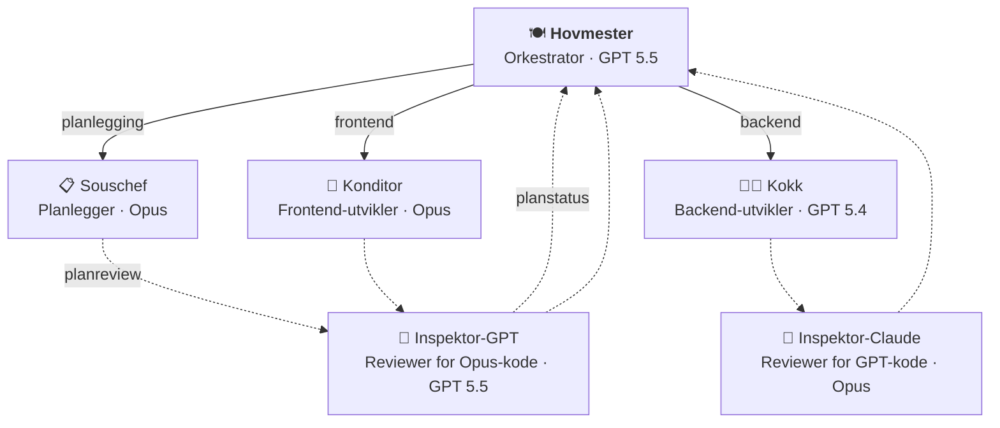

# hovmester 🍽️

Multi-agent Copilot-orkestrering for Nav-team. Én workflow gir repoet ditt en orkestrator (hovmester), en planlegger (souschef), spesialister (kokk/konditor) og kryssmodell-reviewere (inspektører) — pluss felles instruksjoner, skills og issue-/PR-templates.

## Kom i gang

Legg til denne workflowen i repoet ditt som `.github/workflows/hovmester-sync.yml`:

```yaml
name: Sync hovmester
on:
  schedule:
    - cron: '0 5 * * *'
  workflow_dispatch:

permissions:
  contents: write
  pull-requests: write

jobs:
  sync:
    uses: navikt/hovmester/.github/workflows/hovmester-sync.yml@main
    with:
      collections: "frontend"              # eller "backend", "backend,frontend"
      github_project: "navikt/157"         # valgfritt: bytt til ditt teams GitHub Project, eller fjern linjen
```

Kjør workflowen manuelt første gang via `Actions` → `Sync hovmester` → `Run workflow`. Den oppretter en PR med alle filer klare i `.github/`. Merge → du er i gang.

Dette er nok hvis du vil ha sync-PRer og merge manuelt. Hvis du vil auto-merg'e dem, se [Auto-merge](#auto-merge-valgfritt) lenger ned.

Hvis repoet ditt har required CI-checks på PRer, anbefaler vi også App-oppsettet under. Da opprettes sync-PRer som vanlige PRer og trigger CI normalt.

## Agenter

Bruk **@hovmester** som inngang til alt — den koordinerer planlegging, implementasjon og kodegjennomgang automatisk.



| Agent | Rolle | Modell |
|-------|-------|--------|
| **@hovmester** 🍽️ | Orkestrator — mottar forespørselen, delegerer, konsoliderer | GPT 5.5 |
| **@kokk** 👨‍🍳 | Backend-utvikler — API, tjenester, database, Kafka, infra | GPT 5.4 |
| **@konditor** 🎂 | Frontend-utvikler — UI, Aksel, tilgjengelighet, state | Opus |
| *@souschef* 📋 | *(intern)* Planlegger — utforsker kodebasen, lager implementasjonsplaner | Opus |
| **@designer** ✏️ | Designer-agent — designhjelp, Figma-skisser og visuelle konsepter | Opus |
| *@inspektor-claude* 🔬 | *(intern)* Kryssmodell-reviewer — Opus gjennomgår GPT-kode | Opus |
| *@inspektor-gpt* 🔬 | *(intern)* Kryssmodell-reviewer — GPT gjennomgår Opus-kode | GPT 5.5 |

> Én agent eier hele funksjonssnitt vertikalt. I ikke-trivielle arbeidsflyter fanger kryssmodell-review blindsoner: Opus gjennomgår GPT-kode, og GPT gjennomgår både Opus-kode og Souschef-planer for medium/store oppgaver før hovmester presenterer planen.

## Collections

Collections grupperer instruksjoner, skills og agenter i navngitte pakker du velger ved oppsett. `hovmester`-collectionen inkluderes alltid automatisk.

| Collection | Beskrivelse |
|---|---|
| `hovmester` *(alltid inkludert)* | Orkestrator-agentene, felles instruksjoner (sikkerhet, Docker, GitHub Actions), 13 generiske skills og issue-/PR-templates |
| `backend` | Kotlin-instruksjon + 7 backend-skills (Ktor, Spring, Flyway, Kafka, Postgres, API-design, auth) |
| `frontend` | Frontend- og tilgjengelighets-instruksjoner + 6 frontend-skills (Aksel, auth, Figma-workflow, Lumi, prototype, accessibility-review) + designer-agent |

**Eksempler:**
- `"backend"` — backend-repo
- `"frontend"` — frontend-repo
- `"backend,frontend"` — fullstack-repo
- *(ingen collection utover hovmester)* — bare orkestratoren og generiske skills

## Konfigurasjon

| Input | Beskrivelse | Påkrevd |
|---|---|---|
| `collections` | Kommaseparert liste over collections (`backend`, `frontend`, eller `backend,frontend`). `hovmester` er alltid inkludert. | Ja |
| `exclude` | Kommaseparert liste over ting som skal utelates, f.eks. `"kafka-topic,epic"`. | Nei |
| `github_project` | Valgfritt GitHub Project i format `owner/number`, f.eks. `"navikt/123"`. Fjern linjen hvis teamet ikke bruker GitHub Projects. | Nei |
| `pr_app_id` | GitHub App ID for PR-opprettelse. Anbefalt når du bruker auto-merge eller har required CI-checks. | Nei |

| Secret | Beskrivelse |
|---|---|
| `APP_PRIVATE_KEY` | GitHub App private key for PR-opprettelse. Brukes sammen med `pr_app_id`. |

### Issue templates

Default-settet er `bug`, `feature`, `story`, `task` og `epic` (pluss `config`). Hvis du vil utelate noen, bruk `exclude: "epic,task"`.

Hvis `github_project` er satt, auto-linkes nye issues til det prosjektet. Hvis ikke, opprettes de uten prosjekttilknytning.

### Auto-merge (valgfritt)

Auto-merge er valgfritt. Hvis du bare vil ha sync-PRer og merge manuelt, kan du stoppe etter **Kom i gang**.

Hvis du vil auto-merg'e sync-PRene, trenger du tre ting:

1. En GitHub App som oppretter PRen
2. En verify-workflow i consumer-repoet
3. Branch protection som krever verify-jobben

| Ønske | Det du trenger |
|---|---|
| Manuell merge | Kun `hovmester-sync.yml` |
| Manuell merge + vanlig CI på sync-PRer | `hovmester-sync.yml` + GitHub App |
| Auto-merge | `hovmester-sync.yml` + GitHub App + `hovmester-verify.yml` |

**Steg 1 — Opprett GitHub App**

Opprett en [GitHub App](https://docs.github.com/en/apps/creating-github-apps) og installer den i consumer-repoet.

Appen trenger:

- **Contents: Read & write**
- **Pull requests: Read & write**

Lagre deretter:

- Private key som secret: `HOVMESTER_APP_PRIVATE_KEY`
- App ID — du bruker den direkte i sync-workflowen (`pr_app_id: "123456"`)
- Bot-login — du bruker den i verify-workflowen (f.eks. `my-sync-app[bot]`)

Repoet må også ha dette slått på:

- **Allow auto-merge**
- **Allow squash merging**
- **Settings → Actions → General → Workflow permissions → Allow GitHub Actions to create and approve pull requests**

> **Bot-approval:** Hvis dere bruker branch protection eller CODEOWNERS, må oppsettet tillate at sync-PRer kan godkjennes av `github-actions[bot]`. Sørg også for at `.github/`-stier ikke krever manuell CODEOWNERS-review.

**Steg 2 — Send App-credentials inn i sync-workflowen**

Oppdater sync-workflowen fra **Kom i gang** med disse to linjene:

```yaml
jobs:
  sync:
    uses: navikt/hovmester/.github/workflows/hovmester-sync.yml@main
    with:
      collections: "frontend"
      github_project: "navikt/157"         # valgfritt
      pr_app_id: "123456"                  # din GitHub Apps ID
    secrets:
      APP_PRIVATE_KEY: ${{ secrets.HOVMESTER_APP_PRIVATE_KEY }}
```

Da opprettes sync-PRen av Appen i stedet for `github-actions[bot]`. Det gjør to ting:

- vanlige `pull_request`-checks og CI trigges som normalt
- verify-workflowen kan godkjenne PRen med `GITHUB_TOKEN` uten self-approval-konflikt

Hvis du bare trenger at CI skal trigges på sync-PRer, kan du stoppe her og merge manuelt.

**Steg 3 — Legg til verify-workflow**

Legg til `.github/workflows/hovmester-verify.yml` i consumer-repoet:

<details>
<summary>Vis workflow</summary>

```yaml
name: Verify and merge hovmester sync

on:
  pull_request_target:
    types: [opened, synchronize, reopened]
  merge_group:

jobs:
  verify-hovmester-sync:
    if: github.event_name == 'merge_group' || (github.head_ref == 'hovmester-sync' && github.event.pull_request.head.repo.full_name == github.repository)
    runs-on: ubuntu-latest
    timeout-minutes: 5
    permissions:
      contents: read
      pull-requests: write
    steps:
      - name: Verify file scope
        env:
          GH_TOKEN: ${{ github.token }}
          PR_NUMBER: ${{ github.event.pull_request.number }}
          HEAD_REF: ${{ github.head_ref }}
          HEAD_REPO: ${{ github.event.pull_request.head.repo.full_name }}
          PR_AUTHOR: ${{ github.event.pull_request.user.login }}
          EXPECTED_PR_AUTHOR: "my-sync-app[bot]"  # din GitHub Apps bot-login
          REPO: ${{ github.repository }}
        run: |
          set -euo pipefail

          if [[ "$GITHUB_EVENT_NAME" == "merge_group" ]]; then
            echo "✅ Merge queue — verification already completed on pull_request_target"
            exit 0
          fi

          if [[ "$HEAD_REF" != "hovmester-sync" ]] || [[ "$HEAD_REPO" != "$REPO" ]]; then
            echo "Not a hovmester sync PR — skipping"
            exit 0
          fi

          if [[ -z "$EXPECTED_PR_AUTHOR" ]]; then
            echo "::error::HOVMESTER_APP_BOT_LOGIN must be set"
            exit 1
          fi

          if [[ "$PR_AUTHOR" != "$EXPECTED_PR_AUTHOR" ]]; then
            echo "::error::Unexpected PR author: $PR_AUTHOR"
            echo "Expected PR author: $EXPECTED_PR_AUTHOR"
            exit 1
          fi

          FILES=$(gh api "repos/${REPO}/pulls/${PR_NUMBER}/files" \
            --paginate --jq '.[] | .filename, (.previous_filename // empty)')

          if [ -z "$FILES" ]; then
            echo "::error::No files found from pull request files API; failing closed"
            exit 1
          fi

          echo "Changed files:"
          echo "$FILES"

          while IFS= read -r file; do
            [[ -z "$file" ]] && continue
            case "$file" in
              .github/agents/*|\
              .github/instructions/*|\
              .github/skills/*|\
              .github/ISSUE_TEMPLATE/*|\
              .github/PULL_REQUEST_TEMPLATE.md|\
              .github/.hovmester-manifest.json|\
              .github/.copilot-kitchen-manifest.json)
                ;;
              *)
                echo "::error::File outside sync scope: $file"
                echo "Only hovmester-managed paths are allowed in sync PRs"
                exit 1
                ;;
            esac
          done <<< "$FILES"

          echo "✅ All files within hovmester sync scope"

      - name: Create GitHub App token for merge
        id: app-token
        if: github.head_ref == 'hovmester-sync' && github.event.pull_request.head.repo.full_name == github.repository && github.event.pull_request.user.login == 'my-sync-app[bot]'
        uses: actions/create-github-app-token@f8d387b68d61c58ab83c6c016672934102569859 # v3.0.0
        with:
          app-id: "123456"
          private-key: ${{ secrets.HOVMESTER_APP_PRIVATE_KEY }}

      - name: Approve sync PR
        if: github.head_ref == 'hovmester-sync' && github.event.pull_request.head.repo.full_name == github.repository && github.event.pull_request.user.login == 'my-sync-app[bot]'
        env:
          GH_TOKEN: ${{ github.token }}
          PR_NUMBER: ${{ github.event.pull_request.number }}
          REPO: ${{ github.repository }}
        run: |
          gh pr review "$PR_NUMBER" --repo "$REPO" --approve --body "Auto-approved: file scope verified ✅"

      - name: Enable auto-merge
        if: github.head_ref == 'hovmester-sync' && github.event.pull_request.head.repo.full_name == github.repository && github.event.pull_request.user.login == 'my-sync-app[bot]'
        env:
          GH_TOKEN: ${{ steps.app-token.outputs.token }}
          PR_NUMBER: ${{ github.event.pull_request.number }}
          REPO: ${{ github.repository }}
        run: |
          gh pr merge "$PR_NUMBER" --repo "$REPO" --auto --squash
```

</details>

> `pull_request_target` er trygt her fordi workflowen aldri sjekker ut PR-branchen. Den leser bare filstier via GitHub API og bruker repoets egne workflow-fil fra default branch.
>
> `merge_group`-triggeren er en no-op som lar merge queue passere — verifiseringen skjer allerede på `pull_request_target`. Uten denne vil `verify-hovmester-sync` blokkere merge queue med "Expected — Waiting for status".
>
> Approve-steget bruker fortsatt `GITHUB_TOKEN`, men merge-steget bruker et GitHub App-token fra `HOVMESTER_APP_PRIVATE_KEY`. Det gjør at `gh pr merge --auto --squash` kan legge PRen i merge queue uten å bli stoppet av GitHub sin anti-rekursjon for `GITHUB_TOKEN`-utløste workflow-runs.

**Steg 4 — Sett branch protection**

Sett `verify-hovmester-sync` som required status check på default branch. Hvis dere krever approvals for å merge, må bot-approval telle for disse PRene.

Første gang: merge `hovmester-verify.yml` til default branch før du aktiverer branch protection, ellers får du en chicken-and-egg-situasjon.

Det er hele oppsettet. Når hovmester lager en sync-PR:

1. PRen opprettes av GitHub Appen
2. Verify-workflowen sjekker at kun hovmester-eide stier er endret
3. `github-actions[bot]` godkjenner PRen
4. GitHub auto-merger når required checks er grønne

**Sikkerhetsmodell**

- Sync-scriptet forvalter bare hovmesters managed paths under `.github/`
- `.github/workflows/` er alltid ekskludert fra sync
- Verify-workflowen eies av consumer-repoet og kan ikke synkes over
- Verify-jobben er den uavhengige gaten som stopper auto-merge hvis PRen inneholder andre filstier enn det hovmester skal eie
- Når du bruker auto-merge, sendes App-credentials inn i reusable workflowen for å opprette PRen som App. Det er et bevisst kompromiss for enklere consumer-oppsett

## Slik fungerer det

Workflowen kjøres på cron (eller manuell trigger), sammenligner ditt repos `.github/`-katalog med den valgte collectionen, og oppretter en PR hvis noe har endret seg. Manifest-fila `.github/.hovmester-manifest.json` sporer hvilke filer som er eid av hovmester, så stale filer fjernes automatisk.

Workflowen endrer aldri filer utenfor `.github/`, og `.github/workflows/` er alltid ekskludert — workflows eier du selv. Synkede filer forvaltes av hovmester — ikke rediger dem manuelt, lag egne filer for repo-spesifikke tilpasninger.

## For designere

Er du designer og vil bruke Copilot? Se [Copilot for designere — kom i gang](docs/designer-oppsett.md).

## Bidra

Se `.github/copilot-instructions.md` for arkitektur, filstruktur, og retningslinjer for å legge til nye agenter, instructions og skills.
